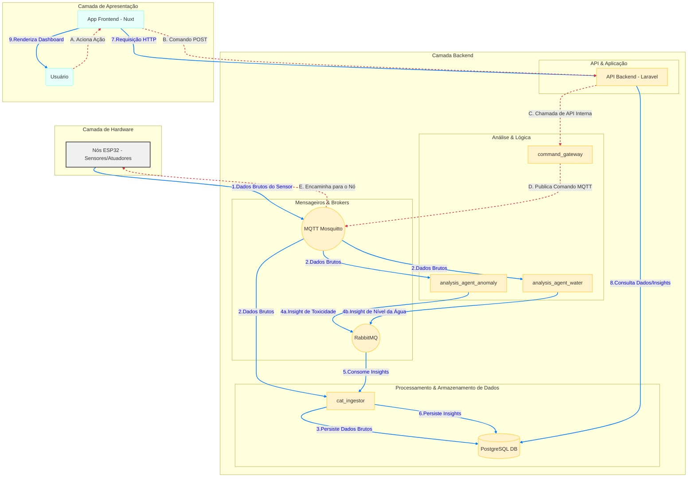

```mermaid
graph TD
    %% Define Styles
    classDef dataflow fill:#e6f2ff,stroke:#b3d9ff,stroke-width:2px;
    classDef commandflow fill:#ffe6e6,stroke:#ffb3b3,stroke-width:2px;
    classDef hardware fill:#f0f0f0,stroke:#333,stroke-width:2px;
    classDef backend fill:#fff2cc,stroke:#ffd966,stroke-width:2px;
    classDef presentation fill:#e6fffa,stroke:#b3ffe6,stroke-width:2px;

    %% Subgraphs
    subgraph "Camada de Hardware"
        direction LR
        A[Nós ESP32 - Sensores/Atuadores]:::hardware
    end

    subgraph "Camada Backend"
        direction TB

        subgraph "Mensageiros & Brokers"
            direction LR
            B((MQTT Mosquitto)):::backend
            C((RabbitMQ)):::backend
        end

        subgraph "Processamento & Armazenamento de Dados"
            direction LR
            E[cat_ingestor]:::backend
            D[(PostgreSQL DB)]:::backend
        end

        subgraph "Análise & Lógica"
            direction LR
            F[analysis_agent_anomaly]:::backend
            G[analysis_agent_water]:::backend
            L[command_gateway]:::backend
        end

        subgraph "API & Aplicação"
            H[API Backend - Laravel]:::backend
        end
    end

    subgraph "Camada de Apresentação"
        direction LR
        J[App Frontend - Nuxt]:::presentation
        K(Usuário):::presentation
    end

    %% Fluxo de Dados (Azul)
    A -- "1.Dados Brutos do Sensor" --> B;
    B -- "2.Dados Brutos" --> E;
    B -- "2.Dados Brutos" --> F;
    B -- "2.Dados Brutos" --> G;
    E -- "3.Persiste Dados Brutos" --> D;
    F -- "4a.Insight de Toxicidade" --> C;
    G -- "4b.Insight de Nível da Água" --> C;
    C -- "5.Consome Insights" --> E;
    E -- "6.Persiste Insights" --> D;
    H -- "8.Consulta Dados/Insights" --> D;
    J -- "7.Requisição HTTP" --> H;
    J -- "9.Renderiza Dashboard" --> K;

    %% Fluxo de Comando (Vermelho)
    K -.->|"A. Aciona Ação"| J;
    J -.->|"B. Comando POST"| H;
    H -.->|"C. Chamada de API Interna"| L;
    L -.->|"D. Publica Comando MQTT"| B;
    B -.->|"E. Encaminha para o Nó"| A;

    %% Aplica Estilos aos Links
    linkStyle 0,1,2,3,4,5,6,7,8,9,10,11 stroke:#007bff,stroke-width:2px,color:blue;
    linkStyle 12,13,14,15,16 stroke:#dc3545,stroke-width:2px,stroke-dasharray:5 5;
```
